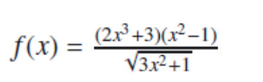

# Calcul d'approximation d'une fonction

Ce projet implémente divers calcul des fonctions qui peuvent etre effectuer via le terminal ci-dessous :

\
___Figure : Menu représentant les opérations possibles à effectuer sur la fonction___

La fonction chosie pour l'égard de ce projet est la suivante : 

\
___Figure : La fonction f(x)___

La dérivée de la fonction est la suivante : 

\
___Figure : La fonction f'(x)___

### Choix 1 : Calcul valeur fonction

- Ce choix calcule la valeur de f (x) pour un point x passé en paramètre.

### Choix 2 : Calcul approximation de la dérivée f ’ 

-Ce choix calcule une approximation de la dérivée f ’ de f en un point x . (On passera la valeur de h en paramètre de la fonction)

### Choix 3 : Calcul approximation de la dérivée f ’'

-Ce choix calcule une approximation de la dérivée seconde f ’’ de f en un point x . (On passera la valeur de h en paramètre de la fonction)

### Choix 4 : Déterminer signe de f''

-Ce choix détermine le signe de la dérivée seconde de f en fonction de x.

### Choix 5 : Quitter


## Execution :

1. Compilez le programme en exécutant :

   ```bash
   gcc -o main Main.c -lm

2. Exécutez le programme :

    ```bash
    ./main

### Auteur

Ibtissam BENABID\
[](https://github.com/IbtissemeBENEBID)
[](https://www.linkedin.com/in/ibtissam-benabid/)


